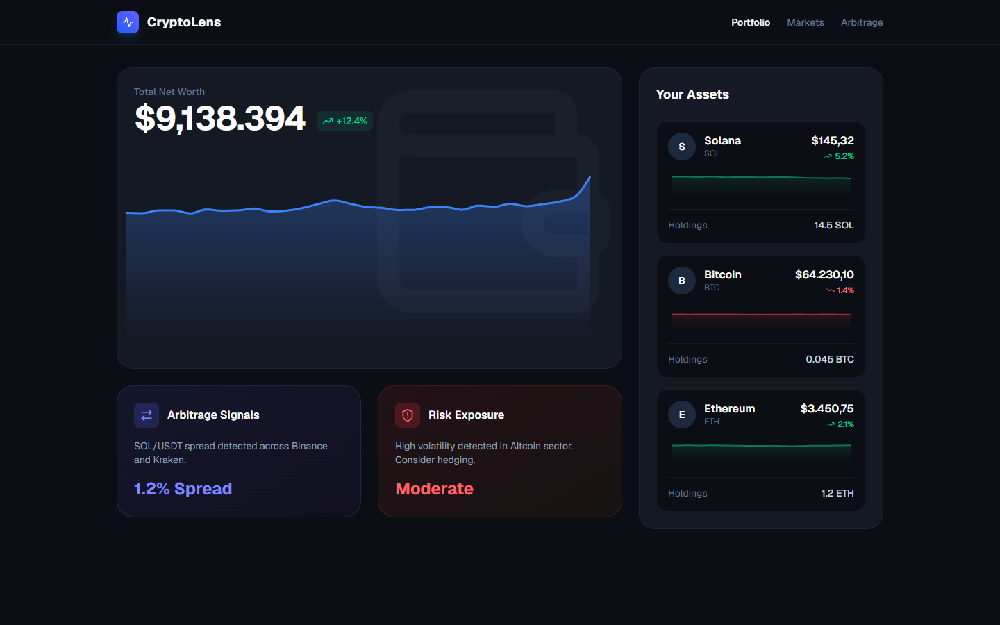

# CryptoLens - Real-Time Portfolio & Arbitrage Tracker

**Author:** Zanyar Erkozan

---

## 📋 Overview
CryptoLens is an advanced, high-performance financial dashboard built for cryptocurrency investors and traders. It acts as an upgrade to traditional CLI/Telegram bots (like my Solana Wallet Tracker) by providing a full visual suite for tracking net worth, analyzing asset charts, and catching cross-exchange arbitrage opportunities.

## ⚙️ Core Features
- **Dynamic Portfolio Tracking:** Real-time calculation of total net worth with historical performance area charts.
- **Asset Data Visualization:** Individual asset sparklines and 24h change indicators powered by `recharts`.
- **Arbitrage & Risk Engine:** Simulated signals alerting users to market inefficiencies (e.g., exchange spreads) and portfolio exposure risks.
- **Glassmorphism UI:** A sleek, deep-dark-themed interface utilizing `framer-motion` for smooth rendering and transitions.
- **API Architecture:** Next.js serverless routes providing structured JSON financial data.

## 🛠️ Technology Stack
- **Framework:** Next.js 14 (App Router)
- **Styling:** Tailwind CSS
- **Charts:** Recharts
- **Animations:** Framer Motion
- **Icons:** Lucide React

## 📸 Screenshots

*(This is a locally developed prototype. Below is an actual screenshot of the working application.)*



## 🚀 Local Development Showcase

This application was designed, built, and tested locally. It is intended to showcase my ability to build complex, production-ready, full-stack applications.

If you wish to run it locally:
1. **Install dependencies:**
   ```bash
   npm install
   ```
2. **Run the development server:**
   ```bash
   npm run dev
   ```
